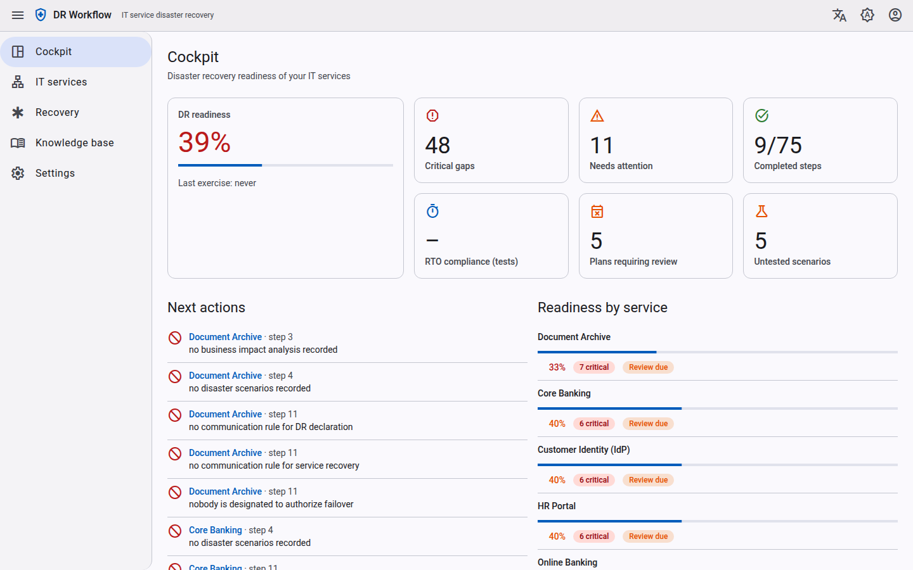
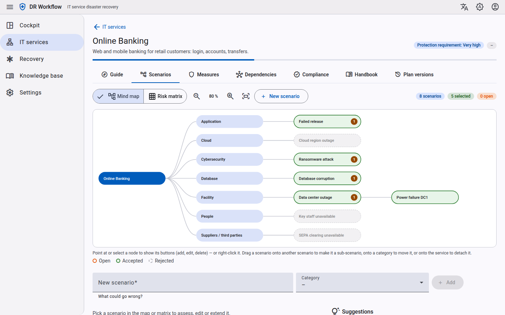
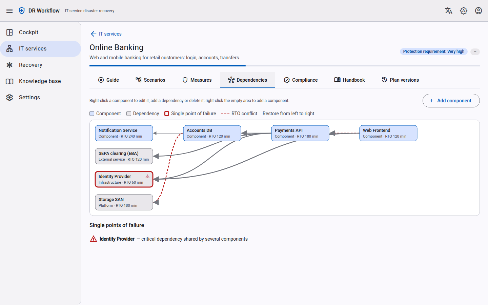

# dra-workflow

**Guided, workflow-based disaster recovery planning and recovery execution for IT services.**

dra-workflow helps teams create disaster recovery (DR) plans for their IT services without starting
from an empty template, and guides responders step by step when a disaster actually happens. The
method follows **NIST SP 800-34 Rev. 1** and **BSI-Standard 200-4** (with IT-Grundschutz CON.3 and DER.4).

> **Status: early development.** The API and data model still change. Authentication is mocked
> (`--dev-mode`); Keycloak and an API gateway are prepared but the backend does not validate tokens
> yet. Do not expose it on a shared network or use it for production DR plans yet.

## Screenshots

| Cockpit | Scenario mind map | Dependency map |
|---|---|---|
| [](docs/assets/screenshots/cockpit.png) | [](docs/assets/screenshots/scenario-mindmap.png) | [](docs/assets/screenshots/dependencies.png) |
| Readiness, critical gaps and next actions across all IT services | Brainstorm scenarios per category, then accept or reject them | Restore order, RTO conflicts and single points of failure |

More screens (guide, risk matrix, measures, compliance, handbook, dark mode) are in the
[UI tour](docs/guide/ui-tour.md).

## Features

- **Guided workflow**: 15 steps in 5 phases, grouped into a 7-stage guide with guiding questions,
  required/optional hints, gates with blocking issues and warnings, and a "what next" hint.
- **Scenario brainstorming**: mind map (service → category → scenario → sub-scenario) with drag & drop,
  15 categories, rule-based suggestions, merge, accept/reject with rationale, and a 4×4 risk matrix.
- **Business impact analysis**: MTPD, RTO, RPO, minimum operating level and impact ratings over time.
- **Components and dependencies** (optional): dependency map in restore order, RTO conflicts and
  single points of failure.
- **Measures (recovery strategies)**: one measure can cover several scenarios; gap check against the
  objectives (BSI "Soll-Ist-Vergleich"), implementation status and last test date.
- **Roles and communication**: role assignments with deputies, communication rules, who authorizes
  failover.
- **DR plan**: generated from structured data, live handbook preview, immutable approved versions,
  Markdown export for offline use.
- **Readiness dashboard**: readiness score, critical gaps, next actions, RTO compliance, untested scenarios.
- **Compliance mapping**: requirement → what to do → evidence → status (NIST SP 800-34, BSI 200-4,
  IT-Grundschutz).
- **Recovery runs**: declare a disaster against the approved plan, execute runbook steps with
  verification, live progress (API/MCP; UI in progress).
- **AI access via MCP**: use-case based tools on `POST /mcp` (for example `create_service`,
  `suggest_scenarios`, `add_mitigation`, `get_readiness`, `declare_recovery`).
- Multi-tenant (tenant from the token, PostgreSQL row-level security), English and German UI, dark mode.

What is built and what is still open is tracked in
[docs/requirements/feature-status.md](docs/requirements/feature-status.md).

## Architecture

| Part | Technology |
|------|------------|
| Backend | Rust (`dra-server`): tokio, axum, tower, sqlx, clap; hexagonal, sliced by feature |
| Database | PostgreSQL 17 with forced row-level security and an audit trigger |
| API | REST, contract first: [`api/openapi.yaml`](api/openapi.yaml); MCP endpoint `/mcp` |
| Frontend | Angular 21 (standalone, signals, zoneless) with Angular Material 3 |
| Identity / gateway | Keycloak (organizations = tenants) and APISIX (prepared) |
| Docs | Markdown knowledge base in [`docs/`](docs/README.md), including ADRs |

```
api/          OpenAPI contract
backend/      Rust crate dra-server (src/features/<feature>/{domain,application,infra,api})
frontend/     Angular app
deploy/       PostgreSQL init, Keycloak realm, APISIX config
docs/         Architecture, ADRs, domain model, workflows, requirements, UI tour (MkDocs: mkdocs.yml)
```

## Quick start

Prerequisites: Docker with Compose, `make`. For local development also Rust (stable, ≥ 1.85) and
Node.js 24.

```bash
cp .env.example .env        # then replace every "change-me" (e.g. openssl rand -hex 24)
make app-up                 # PostgreSQL, Keycloak, APISIX + backend and UI containers
```

Open <http://localhost:9080> (through the API gateway): you are redirected to the Keycloak login;
sign in as `demo-user` with `DEMO_USER_PASSWORD` from `.env`. <http://localhost:8080> reaches the UI
container directly, without login (development mode, tenant `demo`).

### Development

```bash
make run        # PostgreSQL + backend in dev mode on http://127.0.0.1:8090
make ui         # Angular dev server on http://localhost:4200 (proxies /api and /mcp)
make check      # formatting, lints, backend and frontend tests, OpenAPI lint
make docs-serve # documentation site on http://127.0.0.1:8000
make help       # all targets
```

The backend is configured with command-line arguments or `DRA_*` environment variables only
(`dra-server serve --help`). Container images: [docs/architecture/deployment.md](docs/architecture/deployment.md).

## Documentation

The documentation site is published to GitHub Pages at <https://uid09552.github.io/dra-plan/>
(built from `docs/` by the [Docs workflow](.github/workflows/docs.yml); preview locally with `make docs-serve`).

The knowledge base in [`docs/`](docs/README.md) is plain Markdown (an OKF bundle) and is also published
as a MkDocs site: `make docs-serve` for a live preview on <http://127.0.0.1:8000>, `make docs` for a
strict build into `site/` (needs Python 3).

- [Knowledge base](docs/README.md): vision, architecture, ADRs, domain model, workflows
- [UI tour](docs/guide/ui-tour.md): the main screens with screenshots
- [Feature requirements](docs/requirements/README.md) and [feature status](docs/requirements/feature-status.md)
- [Plan-authoring workflow](docs/workflows/plan-authoring.md) and [recovery execution](docs/workflows/recovery-execution.md)
- [REST API](docs/architecture/api.md) and [MCP interface](docs/architecture/mcp.md)

## Contributing

Contributions are welcome. Please read [CONTRIBUTING.md](CONTRIBUTING.md) before opening an issue or
pull request. Please do not report security vulnerabilities in public issues; see
[CONTRIBUTING.md](CONTRIBUTING.md#reporting-security-issues).

## License

Licensed under the [Apache License, Version 2.0](LICENSE). See [NOTICE](NOTICE).
