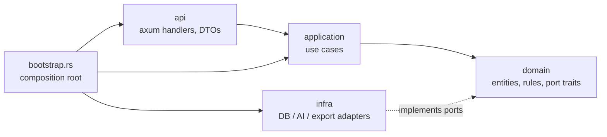

# Backend Architecture

Rust, **hexagonal (ports and adapters)**, **sliced by feature**. It implements the contract in `api/openapi.yaml` ([[api]]). The decision is recorded in [[0007-hexagonal-feature-sliced-backend]].

## Stack

| Concern | Crate |
|---------|-------|
| Async runtime | `tokio` |
| HTTP | `axum` |
| Middleware | `tower`, `tower-http` (trace, request-id, timeout, body limit, CORS, set headers, compression) |
| CLI and settings | `clap` (derive + `env` feature) |
| `.env` loading (development) | `dotenvy` (the maintained fork of `dotenv`) |
| Logging and tracing | `tracing`, `tracing-subscriber` |
| Errors | `thiserror` (library), `anyhow` (binary edges) |
| Secrets in memory | `secrecy` |
| DTO validation | `validator` (derive) + `serde` with `deny_unknown_fields`; `serde_path_to_error` for JSON pointers |
| Database access | PostgreSQL via `sqlx` 0.8 (runtime queries, no compile-time DB needed). Only in `infra/`. |

## Layout

`backend/` is the `dra-server` crate itself (no workspace):

```
backend/
├── Cargo.toml
├── migrations/0001_init.sql      # schema, composite tenant FKs, forced RLS, audit trigger
│   0002_scenario_tree_and_mitigation_status.sql   # sub-scenarios, 15 categories, recovery capability
│   0003_default_component.sql     # default component per service (ADR-0011)
│   0004_strategy_scenarios.sql    # a measure covers one or more scenarios
├── src/
│   ├── main.rs                   # dotenvy + clap parse → cli::run
│   ├── cli.rs                    # subcommands: serve, migrate, seed-catalog, export, healthcheck
│   ├── config.rs                 # clap args with env = "DRA_…" fallback
│   ├── bootstrap.rs              # composition root: adapters → use cases → AppState → Router
│   ├── app.rs                    # AppState (one Arc<…UseCases> per feature)
│   ├── mcp/                      # MCP inbound adapter (/mcp), use-case tools
│   ├── shared/
│   │   ├── kernel/               # AppError, Issue, TenantContext, Meta, Minutes, Rating, str_enum!
│   │   ├── auth/                 # Authenticator port, Dev/Disabled/Static adapters, extractors
│   │   ├── web/                  # problem+json, ValidJson/IfMatch/ApiPath extractors, tower layers
│   │   └── infra/                # Db (tenant-scoped transactions), error mapping, row helpers
│   └── features/<feature>/       # domain.rs · application.rs · infra.rs · api.rs
│       tenants directory catalog it_services bia scenarios microservices dependencies
│       objectives strategies data_protection runbooks roles_comm workflow plans
│       dr_tests action_items ai recovery_runs audit readiness
└── tests/                        # integration tests against PostgreSQL (real router)
```

Each layer is a module (a file; it can become a folder when it grows). Layers without content are left out:
`catalog` is static data compiled into the binary, so it has only `domain` and `api`. Features correspond to the
OpenAPI tags; each exposes `api::routes()`, merged in `bootstrap.rs`.

## Dependency rule



- **domain:** has no framework dependencies (no tokio, axum, serde or DB crates). It declares ports as traits, for example:
  ```rust
  pub trait ScenarioRepository: Send + Sync {
      async fn get(&self, ctx: &TenantContext, id: ScenarioId) -> Result<Option<Scenario>, RepoError>;
      async fn save(&self, ctx: &TenantContext, s: &Scenario) -> Result<(), RepoError>;
  }
  ```
- **application:** use cases receive their ports through constructor injection (`Arc<dyn Port>` or generics). They enforce authorization, run workflow gates, and define transaction boundaries.
- **infra:** adapters that implement ports. This is the only place with SQL or HTTP clients. Every query filters by `ctx.tenant_id()`, and database row-level security is defense in depth.
- **api:** extract (`TenantContext`, path, validated DTO) → call a use case → map to a response DTO. There is no business logic in handlers.
- **Across features:** a feature calls another feature only through its `application` interface or a shared port, never its `infra` or `api`.

## Configuration (CLI-first)

One binary, `dra-server`, with clap subcommands:

| Subcommand | Purpose |
|------------|---------|
| `serve` | Run the HTTP API |
| `migrate` | Apply database migrations |
| `seed-catalog` | Ensure the default DR roles exist in every tenant (scenario templates and strategy types are compiled in) |
| `export` | Export a plan version to Markdown or JSON on disk (offline emergency handbook) |
| `healthcheck` | Exit 0 or 1 (for container probes) |

Rules:
- **No config files.** Every setting is a clap argument with an environment fallback. The precedence is **CLI argument > env var > `.env` (dotenvy, development only) > default**.
- Environment variable names use the prefix `DRA_`, for example `DRA_LISTEN_ADDR`, `DRA_DATABASE_URL`, `DRA_OIDC_ISSUER`, `DRA_OIDC_AUDIENCE`, `DRA_JWKS_URL`, `DRA_TENANT_CLAIM` (default `tenant_id`), `DRA_CORS_ORIGINS`, `DRA_AI_PROVIDER`, `DRA_AI_API_KEY`, `DRA_LOG_FORMAT` (`json` or `pretty`) and `RUST_LOG`.
- Secrets are `SecretString` and are redacted in `Debug` output and logs. `.env` is git-ignored, and `.env.example` documents the variables.
- The whole configuration is validated at startup. An invalid configuration exits with a clear message and a non-zero code.

## DTOs and validation

| Level | Where | What | Failure |
|-------|-------|------|---------|
| Syntactic | `api/dto.rs` | Types, required fields, lengths, ranges, formats, enums, `deny_unknown_fields` | `422` + `issues[]` |
| Semantic | `domain` constructors and value objects | Invariants such as `Minutes ≥ 0` and `Rating 1..=4` (parse, don't validate) | `422` |
| Cross-entity | `domain/rules.rs`, invoked by `application` | Integrity rules and workflow gates ([[dr-plan-model]] §4) | `422` with `ruleId`, `standardRef` |

DTOs use serde `camelCase` and mirror `api/openapi.yaml` exactly. Domain types are never serialized to the wire.

## Implementation notes

- **One error type.** Domain and application share `AppError` (kernel, framework-free). Infra maps `sqlx`
  errors into it (`23505` → 409, `23503` → 409 on delete / 422 on write, `23514` → 422); `shared/web`
  renders it as problem+json.
- **Tenant isolation, three layers.** (1) `TenantContext` is required by every repository call;
  (2) every query filters on `tenant_id`, and all references are **composite foreign keys**
  `(tenant_id, …_id)`, so rows cannot point into another tenant; (3) **forced row-level security**
  reads `app.tenant_id`, set per transaction by `Db::begin(ctx)`. The application role must not be a
  superuser (superusers bypass RLS) — see `deploy/postgres/init.sql`.
- **Audit log** is written by a database trigger (`audit_row()`), with the actor from `app.actor`, so no
  write path can forget it.
- **Plan snapshots** are the published `PlanSnapshot` JSON (`plans::api::JsonSnapshotCodec` implements the
  `SnapshotCodec` port). Recovery runs copy the runbook steps of the pinned snapshot into
  `run_step_state`, so later edits never change a running recovery.
- **Live updates** (`/recovery-runs/{id}/stream`) use an in-process broadcast bus. This is correct for a
  single instance; running several instances needs PostgreSQL `LISTEN/NOTIFY` or a broker.
- **Authentication and authorization are mocked** (`--dev-mode`: admin `dev-user`, tenant `demo`,
  `X-Dev-Tenant` header to switch). Without `--dev-mode` every API call returns 401 (fail closed).
- **Readiness and compliance** (`features/readiness`) are read models: `WorkflowUseCases::evaluate`
  returns workflow state, plan aggregate, DR tests and the approved plan in one pass, and the pure
  `readiness::domain` derives the score (2 points per completed step with passed gate, 1 per passed gate),
  next actions (blocking before warnings), RTO compliance from test results, untested scenarios and the
  NIST/BSI requirement status (`REQUIREMENTS` maps each requirement to workflow steps).
- **Single points of failure** are derived in `dependencies::domain` (a critical dependency shared by
  several microservices, or a critical dependency without its own DR plan) and shown in the dependency graph.
- **Recovery capability:** strategies carry `implementation_status` and `last_tested_at`; the
  recovery-strategies gate warns about selected strategies that are not implemented or never tested.
- **Migrations and RLS:** data fixes in migrations run as the non-superuser app role, so forced RLS would
  hide all rows. Lift it for the statement (`alter table … no force row level security` … `force …`) inside
  the migration transaction (see `0002`).
- **AI** has no provider yet (`NoAiProvider` → 503); rejecting suggestions works, applying them returns 501.

## Error handling

`domain` errors (`thiserror`) → `application::Error` (NotFound, Forbidden, Conflict, Validation(issues), PreconditionFailed, Unavailable, Internal) → a single `IntoResponse` in `shared/web` that produces RFC 9457 `application/problem+json`. Internal errors are logged with the request id, and the client only gets a generic message.

## Security (OWASP Top 10 baseline)

| Risk area | Controls |
|-----------|----------|
| Broken access control | The tenant comes only from the JWT claim (`TenantContext` extractor). Repositories cannot be called without it. Database row-level security. Role and DR-role checks in the application layer. `404` for other tenants' ids (no IDOR). |
| Cryptographic failures | TLS everywhere. Encryption at rest. Secrets never in plans (references only). `secrecy` for secrets in memory. |
| Injection | Parameterized queries only. **LLM output is untrusted:** proposals pass the same DTO and domain validation. Markdown is rendered and sanitized on the client. |
| Insecure design | Workflow gates, the approval step, immutable plan versions, and threat modeling for new features. |
| Security misconfiguration | Secure defaults. Strict CORS allowlist. Security headers (HSTS, `X-Content-Type-Options`, `Cache-Control: no-store` for API responses). No debug output in production. Configuration validated at startup. |
| Vulnerable components | `Cargo.lock` committed. `cargo audit` and `cargo deny` (advisories, licenses, sources) in CI. Dependabot or Renovate. |
| Authentication failures | JWT validation through JWKS, an algorithm allowlist, and checks on `iss`, `aud`, `exp` and `nbf` with small clock skew. No session state on the server. |
| Integrity failures | Append-only audit log and run timeline. Signed and reproducible builds. Approved plan snapshots cannot change. |
| Logging and monitoring failures | `tracing` with request id and tenant id. Security events logged. No plan contents, tokens or personal data in logs. |
| SSRF | Outbound URLs (AI provider, identity provider) come from configuration only. No fetching of user-supplied URLs. |
| Resource exhaustion | Body size limit, request timeout, concurrency limit, `limit ≤ 200`, and rate limits on AI endpoints. |

## Testing

| Layer | Approach |
|-------|----------|
| domain | Pure unit tests (rules, gates, value objects) |
| application | Use-case tests with in-memory fake ports |
| api | Router tests with `tower::ServiceExt::oneshot`, plus contract checks against `api/openapi.yaml` |
| infra | Integration tests against a real database, including tenant-isolation tests |
