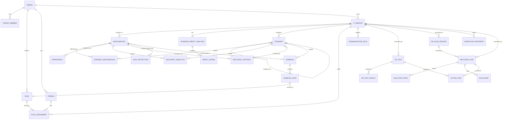

# Data Model

> Conceptual and logical model. It doesn't depend on a particular database engine, which is still open ([[open-questions]]). Names are the proposed table names.

## 1. Hierarchy

```
Tenant                                   (organization, isolation boundary)
 └─ IT Service                           (business-facing service, owns the DR plan)
     ├─ service-level DR items           (BIA, scenarios, communication, tests, plan versions)
     └─ Component (API: microservice)   (optional; one default component = the whole service)
         └─ DR items                     (dependencies, objectives, strategies,
                                          data protection, runbooks)
```

Why there are two levels of DR items (see [[0004-tenant-service-microservice-hierarchy]]):
- **Business impact, tolerable downtime and disaster scenarios** are business-facing. They belong to the **IT service** (NIST: mission/business process; BSI: Geschäftsprozess/Dienst).
- **Recovery is technical.** Each **component** (API name: microservice) gets its own objectives, strategies, backups and runbook, and these must meet the IT service's targets. Components are optional: every service has a default component that stands for the whole service, and scenarios without explicitly affected components apply to it ([[0011-optional-components]]).

## 2. Entity-relationship diagram



Measures (recovery strategies) cover **one or more scenarios** of their IT service (link table `recovery_strategy_scenario`, migration `0004`). The gap check compares the measure with the objective of each covered scenario; the worst gap counts. At most one selected measure per component and scenario (enforced when selecting). A scenario covered by a measure cannot be deleted.


## 3. Entities

Conventions for every table:
- `id` is a UUID primary key.
- `tenant_id` appears on **every** table (denormalized), so tenant isolation can be enforced (for example with row-level security) without joins.
- Every table has `created_at`, `created_by`, `updated_at` and `updated_by`.
- `origin` (`user` | `ai_accepted` | `import`) appears on content tables to record provenance (see [[plan-authoring]]).

### 3.1 Tenant level

| Table | Key fields | Notes |
|-------|-----------|-------|
| `tenant` | name, slug, settings (defaults for impact categories, time windows, review interval) | Isolation boundary |
| `tenant_member` | user_ref, tenant_role (`admin`, `author`, `reviewer`, `responder`, `auditor`) | Access control. The authentication provider is still open. |
| `person` | name, email, phone, alternate_contact, team | Contact directory. Must also be exportable for offline use. |
| `role` | name, description, is_default | Catalog of DR roles: Incident Commander, DBA, Platform, Service Team, Comms, Service Owner |

### 3.2 IT service level

| Table | Key fields | Notes |
|-------|-----------|-------|
| `it_service` | name, description, business_owner (person), technical_owner (person), users/consumers, protection_requirement_availability (`normal`/`high`/`very_high`, BSI), impact_level (`low`/`moderate`/`high`, NIST FIPS 199), lifecycle_status | Workflow step 1 |
| `business_impact_analysis` | mtpd_minutes, service_rto_minutes, service_rpo_minutes, minimum_operating_level (text, BSI *Notbetriebsniveau* / MBCO), regulatory_requirements, approved_at | One per service. The upper bounds for all microservice objectives. |
| `impact_rating` | bia_id, impact_category (`financial`, `operational`, `reputational`, `legal_regulatory`, `people_safety`), time_window (for example 1h, 4h, 1d, 3d, 1w), level (1–4) | Impact over time. MTPD is derived from where the level crosses the tenant's tolerance. |
| `scenario` | title, description, category (see [[scenario-catalog]]), status (`brainstormed`, `merged`, `selected`, `rejected`), merged_into_id, likelihood (1–4), impact (1–4), priority, dr_required (`yes`, `no_handled_by_ha`, `no_accepted_risk`, `degraded_mode`), decision_rationale | Brainstorm → consolidate → select (workflow steps 4–6) |
| `scenario_microservice` | scenario_id, microservice_id | Which microservices a scenario affects |
| `role_assignment` | it_service_id, role_id, person_id, is_deputy, escalation_order | Every role needs a deputy (BSI *Vertretung*) |
| `communication_rule` | trigger (`dr_declared`, `status_update`, `recovered`, `failback`), audience (`internal`, `management`, `customers`, `regulator`), channel, frequency_minutes, responsible_role_id, authorizer_role_id, template | Workflow step 11 |
| `dr_test` | type (`plan_review`, `tabletop`, `simulation`, `technical_recovery`, `full_dr`), scenario_id, planned_at, executed_at, participants, outcome, report | Workflow step 13 |
| `dr_test_result` | dr_test_id, microservice_id, target_rto, achieved_rto, target_rpo, achieved_rpo, passed | Workflow step 14. Computed from test data. |
| `action_item` | source (`test`, `run`, `review`, `ai_gap_check`), source_id, description, owner_person_id, due_date, status | Workflow step 15. Feeds back into the plan. |
| `dr_plan_version` | version, status (`draft`, `in_review`, `approved`, `retired`), snapshot (JSON of the full service subtree), approved_by, approved_at, next_review_due | Immutable once approved. Used for export and pinned by recovery runs. |
| `workflow_progress` | it_service_id, step_key, status (`not_started`, `in_progress`, `complete`, `needs_review`), completed_by, completed_at | Resumable wizard state |

### 3.3 Microservice level: DR items

| Table | Key fields | Notes |
|-------|-----------|-------|
| `microservice` | it_service_id, name, description, owner_team, runtime/platform, hosting_location (region/data center), data_stores, restore_order, criticality_within_service | Technical component |
| `dependency` | microservice_id, kind (`microservice`, `infrastructure`, `platform`, `external_service`, `supplier`, `personnel`), target_microservice_id (nullable), target_name, direction (`upstream`, `downstream`), criticality (`critical`, `degradable`, `optional`), dependency_rto_minutes, has_own_dr_plan | Warns when a dependency's RTO is greater than this microservice's RTO |
| `recovery_objective` | microservice_id, scenario_id (nullable = default), rto_minutes, rpo_minutes, mttr_target_minutes, restore_priority, first_functions (what must work first) | Must satisfy RTO ≤ service RTO and RPO ≤ service RPO |
| `recovery_strategy` | microservice_id, scenario_id, type (see [[scenario-catalog]]), description, estimated_rto_minutes, estimated_rpo_minutes, cost_notes, prerequisites, is_selected | The Soll-Ist gap check compares estimated values with the objective |
| `data_protection` | microservice_id, data_store, method (`snapshot`, `logical_backup`, `replication`, `pitr`), frequency, retention, offsite, immutable, encryption, last_restore_test_at | BSI CON.3 *Datensicherungskonzept*. Needed to prove the RPO. |
| `runbook` | microservice_id, scenario_id, strategy_id, title, version | One runbook per microservice, scenario and strategy |
| `runbook_step` | runbook_id, seq, phase (`activation`, `recovery`, `reconstitution`), title, instructions (Markdown), owner_role_id, expected_duration_minutes, verification, depends_on (step ids), is_decision_point, requires_authorization_role_id | NIST 800-34 plan phases |

### 3.4 Recovery execution

| Table | Key fields | Notes |
|-------|-----------|-------|
| `recovery_run` | it_service_id, plan_version_id, scenario_id, mode (`real`, `test`), status, declared_by, declared_at, recovered_at, closed_at | Pins an approved plan version |
| `run_step_state` | run_id, runbook_step_id (from snapshot), status (`pending`, `in_progress`, `done`, `skipped`, `failed`), assignee, started_at, finished_at, note | Live progress |
| `run_event` | run_id, at, actor, type, payload | Append-only timeline (audit evidence) |

### 3.5 Cross-cutting

| Table | Key fields | Notes |
|-------|-----------|-------|
| `ai_suggestion` | target_table, target_id, field, proposal (JSON), rationale, model, status (`proposed`, `accepted`, `edited`, `rejected`), decided_by | AI provenance. Nothing is applied without a decision. |
| `audit_log` | at, actor, action, entity, entity_id, diff | Append-only |

## 4. Integrity rules

These are enforced in the Rust `domain` layer and are also checked by the workflow gates.

1. `recovery_objective.rto_minutes ≤ business_impact_analysis.service_rto_minutes ≤ mtpd_minutes`
2. `recovery_objective.rpo_minutes ≤ business_impact_analysis.service_rpo_minutes`
3. For each `critical` dependency: `dependency_rto_minutes ≤` the microservice's RTO. Otherwise raise a **blocking** warning ("the service can't recover faster than its dependency").
4. Each selected scenario (`dr_required = yes`) has, for every affected microservice, at least one objective, a selected strategy and a runbook.
5. Selected `recovery_strategy.estimated_rto_minutes ≤` the objective RTO (BSI *Soll-Ist-Vergleich*). Otherwise record a gap as an `action_item`.
6. Every `runbook_step` has an owner role, and every role on the service has a primary person and a deputy.
7. `dr_plan_version` can only become `approved` when all workflow gates pass. Once approved it is immutable.
8. `next_review_due` defaults to 12 months after approval, or earlier after a major change or a failed test.
