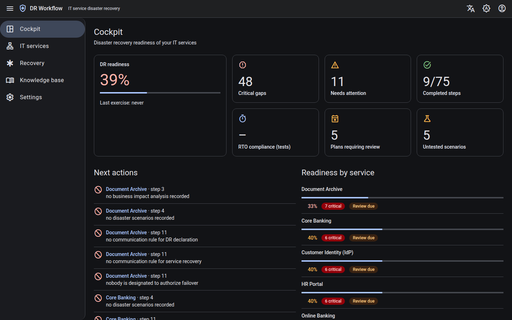
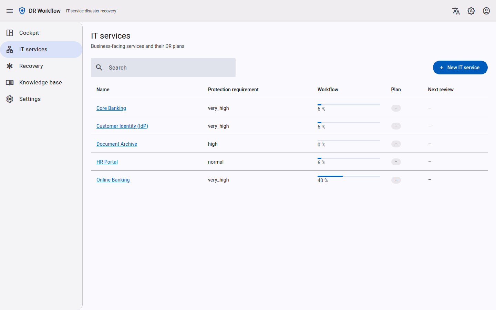
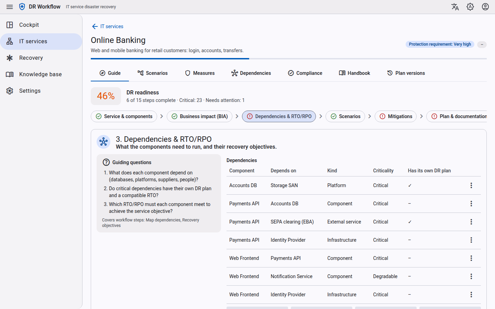
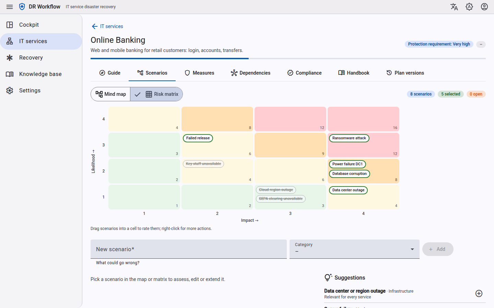
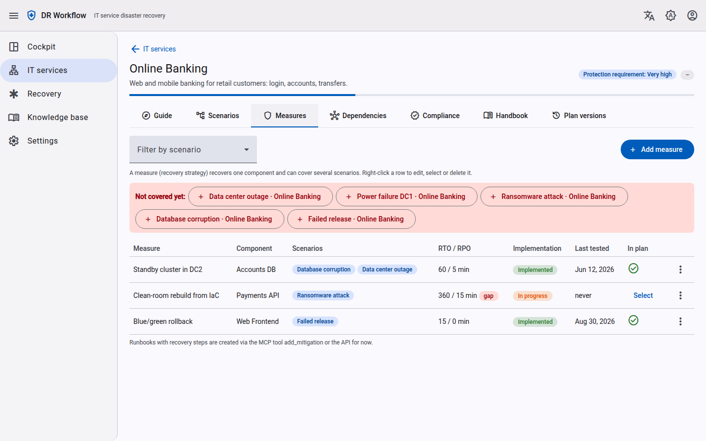
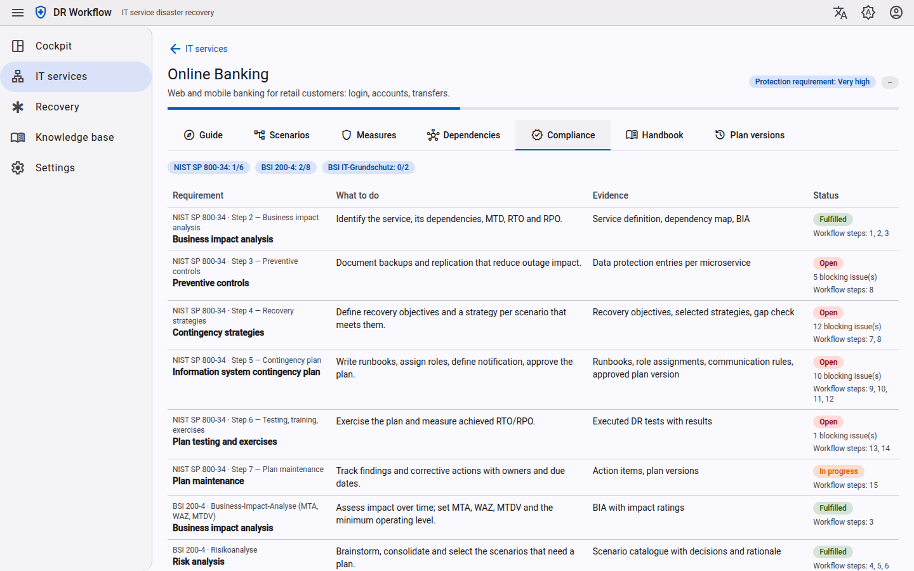
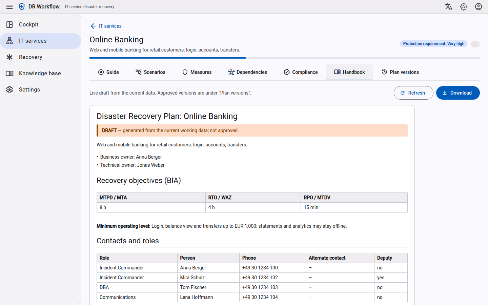

# UI Tour

A walk through the main screens of the cockpit. The screenshots use a demo tenant with an
**Online Banking** service (four components, eight scenarios, three measures) and four further
services. What is built and what is still open is tracked in [[feature-status]].

## Cockpit

The start page shows how ready the tenant is for a disaster: the readiness score, critical gaps,
completed workflow steps, plans that need a review and scenarios that were never tested. **Next
actions** lists the blocking issues of all services, each linked to the workflow step that fixes it.

The UI follows the system color scheme and can be switched to dark mode in the toolbar.

## IT services

Every IT service has its own DR plan. The list shows the protection requirement, the progress of
the authoring workflow and the status of the current plan version.

## Service guide

The **Guide** is the one place to enter and edit plan data. It groups the 15 workflow steps of
[[plan-authoring]] into stages (service and components, business impact, dependencies and RTO/RPO,
scenarios, mitigations, plan and documentation). Each stage shows guiding questions, and the chips
at the top show which stages still have blocking issues.

## Scenarios: mind map and risk matrix

Scenarios are brainstormed in a mind map (service → category → scenario → sub-scenario). Drag a
scenario onto another one to make it a sub-scenario, or onto a category to move it. Accepted
scenarios have a solid border; rejected ones are dashed.

The risk matrix rates likelihood × impact (4 × 4). Drag a scenario into a cell to rate it.

## Measures

A measure (recovery strategy) recovers one component and can cover several scenarios. The gap check
compares its estimated RTO/RPO with the objective (BSI "Soll-Ist-Vergleich"); here the clean-room
rebuild misses the RTO and is flagged as a **gap**. Selected scenarios without a measure are listed
under **Not covered yet**.

## Dependencies

The dependency map shows components and their dependencies in restore order (restore from left to
right). Critical dependencies with a longer RTO than the component that needs them are drawn as
**RTO conflicts** (dashed red), and shared critical dependencies are marked as **single points of
failure**.

## Compliance

The compliance view maps NIST SP 800-34, BSI-Standard 200-4 and IT-Grundschutz requirements to what
to do, the evidence in the tool and the current status. See [[standards-mapping]].

## Handbook

The handbook is generated from the structured data: a live draft while you edit, and immutable
versions once a plan is approved. It can be downloaded as Markdown for offline use during a
disaster.

