# Plan Authoring Workflow

A guided, resumable workflow that builds the DR plan for one **IT service** and its **microservices** ([[dr-plan-model]]). It works like a funnel: **brainstorm broadly → prioritize → define requirements → design recovery → document → test → improve**.

> **Key principle: scenario selection comes before recovery design.** First agree on *which failures the organization has to recover from, and how quickly*. Only then design the technical solution. The workflow enforces this with gates.

## Overview

```mermaid
flowchart LR
    subgraph A[Phase A · Understand]
      S1[1 Define service] --> S2[2 Map dependencies]
    end
    subgraph B[Phase B · Assess]
      S3[3 Business impact] --> S4[4 Brainstorm scenarios] --> S5[5 Consolidate] --> S6[6 Select & prioritize]
    end
    subgraph C[Phase C · Design]
      S7[7 Recovery objectives] --> S8[8 Recovery strategies]
    end
    subgraph D[Phase D · Document]
      S9[9 Runbooks] --> S10[10 Roles & ownership] --> S11[11 Communication] --> S12[12 Review & approve]
    end
    subgraph E[Phase E · Validate & Maintain]
      S13[13 Test] --> S14[14 Measure] --> S15[15 Improve]
    end
    S2 --> S3
    S6 -->|Gate: scenarios agreed| S7
    S8 --> S9
    S12 -->|Gate: plan approved| S13
    S15 -.->|update plan| S3
```

Standards alignment for each phase is in [[standards-mapping]].

### In the UI: Guide tabs

The UI groups the 15 steps into 7 Guide tabs. The tabs follow the editing flow; the workflow step
numbers and gates remain authoritative and can be completed independently:

| Guide stage | Steps |
|-------------|-------|
| Service description & components (optional) | 1 |
| Dependencies & RTO/RPO | 2, 7 |
| Business impact (BIA) | 3 |
| Scenarios (mind map, risk matrix) | 4, 5, 6 |
| Mitigations | 8, 9 |
| Plan & documentation | 10, 11, 12 |
| Test & improve | 13, 14, 15 |

Compliance, the handbook preview and plan versions follow the Guide as review tabs.

Gate warnings for step 8 include `MITIGATION_NOT_IMPLEMENTED` and `MITIGATION_NEVER_TESTED`
(recovery capability). Readiness and "next actions" are derived from the gates; see [[feature-status]].

## Steps

Each step lists what the user provides, the AI support, the data it writes, and its **gate** (completion criteria). Steps can be saved and resumed at any time (`workflow_progress`). Going back to an earlier step marks the steps that depend on it as `needs_review`.

### Phase A: Understand

**1. Define the service.**
- Questions: What does the service do? Who depends on it? Who owns it? Which microservices make it up?
- Writes: `it_service`, `microservice`
- AI support: turns a free-text description into structured fields, proposes a list of microservices, and suggests the BSI protection requirement for availability and the NIST impact level.
- Gate: an owner (business and technical) is set, and there is at least one microservice.

**2. Map dependencies.**
- Questions: upstream and downstream systems, and the infrastructure, platform, external APIs, suppliers and key personnel the service relies on.
- Writes: `dependency`
- AI support: suggests typical dependencies (DNS, identity provider, database, message broker, object storage, monitoring, secrets and certificates), and renders a dependency graph.
- Gate: dependencies are optional (a component without dependencies is fine). Each recorded dependency is classified as critical, degradable or optional; a dependency cycle produces a warning. RTO conflicts of critical dependencies block step 7.

> A DR plan isn't complete if the service can recover but one of its critical dependencies can't.

### Phase B: Assess (BIA and risk)

**3. Business impact analysis.**
- Questions: impact per category over time windows, the maximum tolerable period of disruption (MTPD), the service-level RTO and RPO, the minimum operating level (*Notbetriebsniveau*), and regulatory or customer requirements.
- Writes: `business_impact_analysis`, `impact_rating`
- AI support: explains the terms, checks plausibility (for example "very high availability requirement but a 3-day MTPD?") and drafts the rationale text.
- Gate: RTO ≤ MTPD, and the RPO is set.

**4. Brainstorm scenarios.**
- Questions: an open-ended brainstorm with no filtering yet.
- Writes: `scenario` (status `brainstormed`)
- AI support: suggests scenarios from [[scenario-catalog]] that fit the architecture and dependencies, such as region outage, database corruption, ransomware, or certificate expiry.
- Gate: at least one scenario per relevant category has been considered.

**5. Consolidate and categorize.**
- Questions: merge similar scenarios so you don't plan for 30 slightly different failures, and assign categories (infrastructure, data, application, dependency, security, people/facility).
- Writes: `scenario.category`, `merged_into_id`
- AI support: detects duplicates and near-duplicates and proposes merges.
- Gate: no scenario is left unmerged or uncategorized.

**6. Select and prioritize.**
- Questions: rate likelihood × impact, and decide for each scenario whether DR is required, or whether it is handled by HA, accepted as a risk, or covered by degraded mode. Record the rationale.
- Writes: `scenario.status/priority/dr_required`, `scenario_microservice`
- AI support: pre-fills a risk matrix and challenges decisions that look inconsistent with the BIA.
- **Gate (key gate):** the selection is confirmed by the service owner, and every rejection has a rationale.

Example output of step 6:

| Scenario | Impact | Priority | DR required? |
|----------|--------|----------|--------------|
| Primary region unavailable | Critical | High | Yes |
| Database corruption | Critical | High | Yes |
| Single application instance fails | Low | Low | No, handled by HA |
| External API unavailable | Medium | Medium | Yes, degraded mode |

### Phase C: Design

**7. Recovery objectives.**
- Questions: RTO, RPO, MTTR target and restore priority for each affected microservice and selected scenario, and what must work first.
- Writes: `recovery_objective`
- AI support: derives defaults from the BIA and suggests a restore order based on the dependency graph.
- Gate: integrity rules 1–3 in [[dr-plan-model]] hold.

**8. Recovery strategies.**
- Questions: *how* to recover each microservice in each scenario (backup/restore, replication, active-passive, active-active, cross-region failover, IaC rebuild, degraded mode, manual workaround), plus backup details.
- Writes: `recovery_strategy`, `data_protection`
- AI support: suggests strategies that fit the objective and platform, estimates the achievable RTO/RPO, and runs a **gap check** (BSI *Soll-Ist-Vergleich*) that turns gaps into `action_item`s.
- Gate: each microservice/scenario pair has one selected strategy. Gaps are either closed or accepted with an action item.

### Phase D: Document

**9. Runbooks.**
- Questions: executable steps grouped into **Activation** (declare, assess, notify), **Recovery** (restore, fail over) and **Reconstitution** (validate, return to normal, fail back).
- Writes: `runbook`, `runbook_step`
- AI support: drafts the steps from the strategy, flags steps without a verification or owner, checks ordering against dependencies, and estimates total duration against the RTO.
- Gate: every step has an owner role, a verification and a duration, and the sum of the critical path is ≤ RTO.

Typical runbook skeleton:
1. Declare DR incident
2. Assign incident commander
3. Confirm the scope of the outage
4. Freeze deployments
5. Verify the secondary environment
6. Promote the secondary database
7. Deploy or enable the service
8. Update DNS and traffic routing
9. Validate critical user journeys
10. Communicate service recovery
11. Monitor for stability
12. Plan failback

**10. Roles and ownership.**
- Questions: assign people to roles (Incident Commander, DBA, Platform, Service Team, Comms, Service Owner), with deputies and an escalation order.
- Writes: `role_assignment`
- AI support: detects roles without a deputy and single points of failure in people.
- Gate: every role used in a runbook has a primary and a deputy.

**11. Communication.**
- Questions: who is notified and when, the escalation path, customer communication, update frequency, and who can authorize failover and failback.
- Writes: `communication_rule`
- AI support: drafts message templates for DR declared, status update and recovered.
- Gate: there is a rule for DR declaration and one for recovery, and an authorizer for failover is set.

**12. Review and approve.**
- Questions: a consolidated view of the plan and a completeness report.
- Writes: `dr_plan_version`
- AI support: a final consistency review with an executive summary.
- Gate: all earlier gates pass and a reviewer approves. The approved version is immutable and exportable (Markdown/PDF).

### Phase E: Validate and maintain

**13. Test.**
- Questions: plan and run exercises, increasing in depth: plan review → tabletop → simulation → technical recovery test → full DR test.
- Writes: `dr_test` (and optionally a `recovery_run` in test mode)
- AI support: generates tabletop scripts and injects for the chosen scenario.
- Gate: the plan is not considered proven until at least one tabletop exercise has been run.

**14. Measure.**
- Questions: achieved versus target RTO and RPO for each microservice.
- Writes: `dr_test_result`
- AI support: summarizes the results, for example "Target RTO 2h, achieved 1h35m ✅".
- Gate: results are recorded for every tested microservice.

**15. Improve.**
- Questions: what worked, what failed, what was undocumented, what depended on tribal knowledge, which dependencies weren't available, and which steps took too long.
- Writes: `action_item`, then a new plan draft
- AI support: turns lessons learned into concrete plan changes.
- Gate: action items have owners and due dates, then the cycle loops back.

## AI rules
- Every AI output is stored as an `ai_suggestion`. The user accepts, edits or rejects it, and the origin is recorded on the resulting content.
- AI never approves, never changes an approved plan version, and never performs recovery actions.
- Prompts contain only the data they need. Secrets are never part of a plan (plans store references only).
