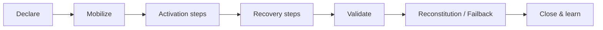

# Recovery Execution Workflow

Turns an **approved** `dr_plan_version` into an interactive runbook during a real disaster or a DR test ([[dr-plan-model]], section 3.4). The phases follow NIST SP 800-34 and BSI 200-4 ([[standards-mapping]]).

| Phase | NIST | BSI | What happens | Data |
|-------|------|-----|--------------|------|
| 1. Declare | Activation & Notification | Alarmierung | Select the IT service and scenario, choose real or test mode. An authorized role declares DR. The approved plan version is pinned to the run. | `recovery_run` |
| 2. Mobilize | Activation & Notification | BAO activation | Show the role assignments with deputies and the escalation path, and trigger the `communication_rule`s for `dr_declared`. | `run_event` |
| 3. Activation steps | Activation | Alarmierung | Assess the scope, freeze deployments, confirm that the primary environment really is unavailable. | `run_step_state` |
| 4. Recovery steps | Recovery | Notbetrieb / Wiederanlauf | Work through the microservice runbooks in `restore_order` and dependency order. Each step is started, done (with verification), skipped (with a reason) or failed. Decision points need the authorizer role. | `run_step_state` |
| 5. Validate | Recovery | Wiederanlauf | Test critical user journeys. The service is back at least at the minimum operating level. | `run_event` |
| 6. Reconstitution | Reconstitution | Wiederherstellung | Return to normal operation, fail back to the primary, and check data consistency. | `run_step_state` |
| 7. Close & learn | Reconstitution (post-event) | Kontinuierliche Verbesserung | Record the achieved RTO/RPO against the targets, write the post-incident report, and create `action_item`s that feed back into [[plan-authoring]] step 15. | `action_item` |

## Live indicators
- **RTO clock:** time elapsed since declaration, compared with the service RTO and the per-microservice RTO.
- **Critical path:** the remaining estimated duration, based on the step estimates.
- **Blocked steps:** steps waiting on failed dependencies.
- **Next status update due:** from `communication_rule.frequency_minutes`.

## AI assistance (advisory only)
- Interprets error messages and suggests troubleshooting within the context of the current step.
- Drafts stakeholder status updates from the timeline.
- Suggests alternatives when a step fails (for example switching to degraded mode).
- Never executes actions and never marks steps as done.

## Requirements
- Every action is written to the append-only `run_event` timeline (actor, timestamp, note). This is audit evidence.
- Multiple responders see live progress at the same time.
- Works with minimal dependencies. The exported plan version (Markdown/PDF) is the fallback if the tool is unavailable.
- Test-mode runs produce `dr_test_result`s the same way real runs do.
